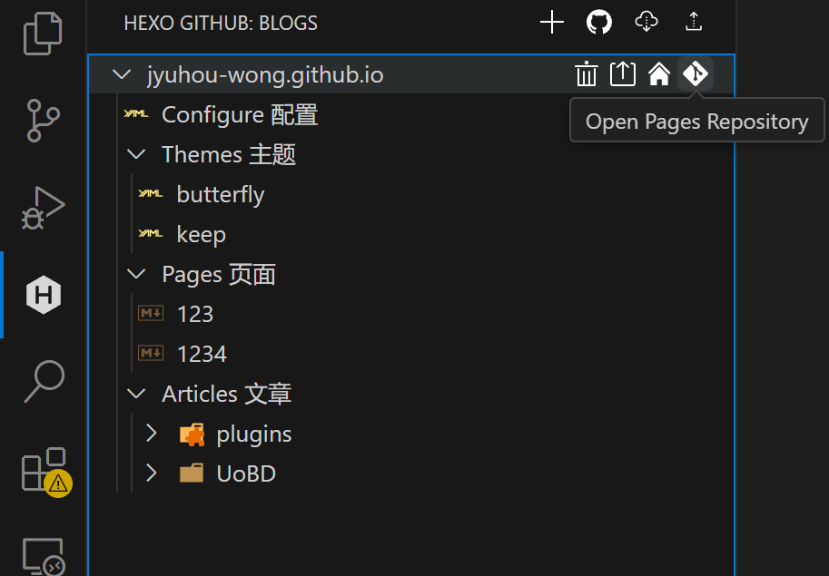

# Hexo-GitHub VSCode Plugin

Hexo-GitHub is a VSCode plugin focused on simplifying Hexo blog management and GitHub integration through intuitive visual operations. Users can easily create, update, and deploy their Hexo blogs with this plugin.

## Demo

Here is an example blog published using this plugin:

[Blog Demo](https://blog.hyh.ltd)

## Features

- **Visual Operations**: Supports most Hexo commands with visual operations to simplify blog management.
- **Login to GitHub**: Securely log in to GitHub using the OAuth flow.
- **Pull and Push**: Pull the latest blog content from GitHub or push local changes to GitHub.
- **Create New Blog Posts**: Easily create new Hexo blog posts.
- **Start and Stop Hexo Server**: Start the Hexo server locally to preview your blog or stop the server.
- **Local Preview**: Open a local preview of your blog in the browser.
- **Deploy to GitHub Pages**: Deploy your blog to GitHub Pages for online access.
- **Manage Blog Files**: Manage your blog’s file structure within VSCode.
- **Dynamic Theme Switching**: Support for dynamic switching and installation of Hexo themes.
- **Configuration Support**: Display and modify configuration in a custom view.

## Installation

1. **Install from VSCode Marketplace**: Search for “Hexo GitHub” in VSCode or visit the [Marketplace link](https://marketplace.visualstudio.com/items?itemName=jyuhou-wong.vscode-hexo-github) to install.
2. **Download VSIX File**: Go to the [Release page](https://github.com/jyuhou-wong/vscode-hexo-github/releases) and download the latest VSIX file.
3. **Install the Plugin**:
   - In VSCode, open the Extensions view (`Ctrl+Shift+X`).
   - Click the three dots in the top right, select **Install from VSIX...**, and choose the downloaded VSIX file.

## Usage Guide

### Visual Operations

The plugin provides an intuitive visual interface, allowing users to easily perform the following operations via context menus:

- **Pull and Push**: Use the navigation menu to pull and push changes.
- **Add New Site**: Add new Hexo blog sites via the navigation menu.
- **Open Source Repository**: Quickly access the source repository on GitHub.

#### Context Menu Operations

- **Deploy Blog**: Deploy blog content to GitHub Pages.
- **Open Pages Repository**: Access the GitHub Pages repository.
- **Open GitHub Pages**: View your blog in the browser.
- **Delete Site**: Remove a blog site.
- **Manage Themes**: Add, apply, or delete Hexo themes.
- **Local Preview**: Preview Markdown files.
- **Add Item**: Add new pages, drafts, or blog posts.
- **Publish Draft**: Publish drafts as official posts.
- **Delete Item**: Delete blog items.

### Views and Menus

## How It Works

1. **Login and Authentication**: The `startOAuthLogin` function handles GitHub login requests, obtains, and stores the access token.
2. **Repository Management**: The `pullHexo` and `pushHexo` functions pull and push blog content from/to GitHub.
3. **Blog Creation and Management**: With `createNewBlogPost` and `addItem`, users can create new blog posts or pages.
4. **Hexo Server Management**: Use `startHexoServer` and `stopHexoServer` to start and stop the local Hexo server, supporting draft previews.
5. **Preview and Deployment**: The `localPreview` function previews the blog locally, and `pushToGitHubPages` deploys the blog to GitHub Pages.
6. **Theme and Configuration Management**: Supports dynamic theme switching and configuration display in custom views.
7. **Tree View Management**: The `BlogsTreeDataProvider` class implements the tree view for blog posts and monitors file system changes.

## Dependencies

This plugin depends on the following npm packages:

- `express`: For creating a local server to handle OAuth callbacks.
- `axios`: For making HTTP requests.
- `simple-git`: For executing Git commands.
- `@octokit/rest`: GitHub REST API client.
- `open`: For opening URLs in the default browser.
- `unzipper`: For extracting Hexo Starter templates.

## Prerequisites

- Node.js version 18 or above installed, with npm package manager.

## Change Log

All notable changes to the "vscode-hexo-github" extension will be documented in this file.

### [3.0.9] - 2025-08-26

#### Changed
- Improved CI workflow for release automation and publishing to VS Code Marketplace and Open VSX.
- README.md cleanup step added to CI.

### [3.0.8] - 2025-08-14
#### Added
- Enhanced Hexo configuration editor
- Preview panel and HTML generation for Hexo blog previews
- Drag-and-drop functionality for Posts and Drafts directories
- setTheme command and associated functionality

#### Changed
- Refined rename command visibility in blog management
- Improved site directory and name form logic

#### Fixed
- Simplified applyTheme function and removed unnecessary destructuring
- Logging imports and formatAddress function to include root path

#### Refactor
- Removed deleteTheme and deleteSite commands; added scaffolds support
- Refactored blogsTreeDataProvider and related imports
- Code style improvements
- Removed unused files and configurations

### [3.0.7] - 2025-06-19
- Fix theme searching issue

### [3.0.6] - 2024-11-29

#### Fixed
- Draft preview button lost issue

### [3.0.5] - 2024-11-07

#### Fixed
- Sites config lost issue

### [3.0.4] - 2024-11-07

#### Added
- Support logging to the output console

### [3.0.3] - 2024-11-06

#### Added
- Support cname changing method

#### Fixed
- Multi-site root path issue

### [3.0.2] - 2024-11-05

#### Refactor
- Some code style.

### [3.0.1] - 2024-11-05

#### Refactor
- Rename `hexo-github` to `vscode-hexo-github`.

### [2.1.1] - 2024-11-05

#### Added
- Added `setGitUser` method

#### Fixed
- Fixed curly issues

### [2.0.11] - 2024-11-01

#### Added
- Support for logout method.

### [2.0.10] - 2024-10-29

#### Added
- Updated installation instructions to include marketplace installation option.

### [2.0.9] - 2024-10-29

#### Added
- Added extension icon.

### [2.0.8] - 2024-10-29

#### Changed
- Changed display name.

### [2.0.6] - 2024-10-28

#### Added
- Added required modules installing method within the initialization of Hexo.

### [2.0.5] - 2024-10-28

#### Fixed
- Fixed default user page creation issue.
- Fixed configuration creation and git initialization issue.

### [2.0.3] - 2024-10-28

#### Added
- Release of version 2.0.3.
- `viewsWelcome` feature.

### [2.0.2] - 2024-10-27

#### Added
- Support for pull and push methods.

### [2.0.1] - 2024-10-27

#### Added
- Release of beta version.
- Site creation support.
- Multiple site support.

### [1.0.7] - 2024-10-25

#### Changed
- Refactored push and pull methods.

### [1.0.6] - 2024-10-23

#### Added
- Support for theme installation.

### [1.0.5] - 2024-10-23

#### Fixed
- Release issue.

### [1.0.4] - 2024-10-23

#### Added
- Support for dynamic theme switching.

### [1.0.3] - 2024-10-22

#### Added
- Dynamic theme switching.
- Theme installation support.
- Configuration display in custom explorer.

#### Fixed
- Button display issue.

### [1.0.2] - 2024-10-20

#### Added
- URL shortcuts and icons.
- Auto-locate target file method.
- Blog explorer panel.

#### Fixed
- TreeView and explorer layout issues.

### [1.0.1] - 2024-10-19

#### Added
- Initial features and fixes, including local preview support.

## 贡献

欢迎任何形式的贡献！请提交问题或拉取请求。

## 感谢

特别感谢 [Hexo](https://hexo.io/) 团队的支持和贡献，使得博客管理变得如此简单。

## 许可证

此项目使用 MIT 许可证。请参阅 [LICENSE](LICENSE) 文件以获取更多信息。
